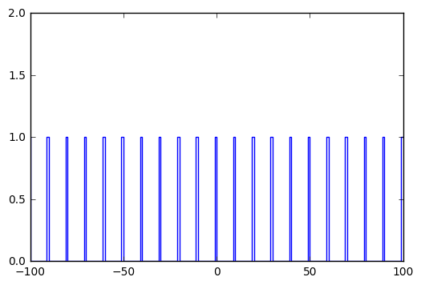
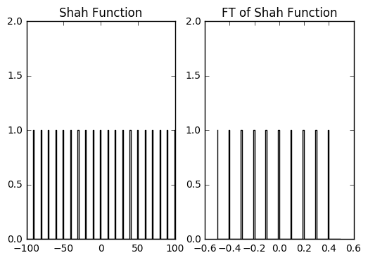

# Fourier Transform 

Worksheet 1 focuses on using Python tasks to calculate the Fourier Transform of a few window functions. In this notebook, I will illustrate how you can generate a window function, and how you can calculate the associated Fourier Transform.

The Fourier Transform can be examined in many ways. The simplest interpretation is that the FT is a harmonic decomposition of a signal. You can calculate the FT analytically, if you're lucky. If you're even luckier, a finite Fourier Series will give you an accurate representation of your signal -- provided that you have a simple signal. 
There is often an implicit assumption when calculating the analytical representation -- that your input function goes from -infinity to +infinity.

In practice, astronomical signals are not perfect, simple sine-waves. Neither are they perfectly sampled, or sampled for infinite time. 
When you have a regularly sampled series, e.g., a time series, you can compute the Fourier Transform using the Fast Fourier Transform (FFT) Algorithm. This is what we're doing in this worksheet -- we are computing the FFT for a series of functions, and we are studying how similar or different the FT is to what we expect from the illustrations on the worksheet.

## When in doubt, Google

There's a reason why WS1 is short on details -- there is a huge amount of resources on the internet that focuses on computing Fourier Transforms using python. In fact, if you Google **Python Fourier Transform**, the first hit will probably be the relevant SCIPY page:
https://docs.scipy.org/doc/numpy-1.13.0/reference/generated/numpy.fft.fft.html#numpy.fft.fft

Please note that there are lots of resources on how to **generate window functions**, such as the _boxcar_ function. You can use a similar method to the one I've done below, or you can simply use a python function to define this. I leave it to you to figure it out.

## Getting started
First, I'm going to import the important libraries, as suggested in the aforementioned URL. Note that `%matplotlib inline` command allows us to render plots within this notebook.

Also note how I have defined *pylab* and *numpy* in the Python namespace. This makes it easy to
reference plotting and analytical functions from those libraries. $$ E = mc^2 $$.

```
import numpy.fft as fft
import pylab as pl
import numpy as np
%matplotlib inline
```

## 1.1. The Shah Function

The Shah function (Comb) is a series of delta functions with some spacing  \\( \Delta x \\). 

The image below is from your WS1, and is one of the examples found in the ERA appendix on Fourier Transforms:
http://www.cv.nrao.edu/~sransom/web/A1.html


In the next cell I define the Shah function, by hand. Note how I use the `np.mod` function. This returns the remainder of division, so I've inserted an _if_ statement that appends a **1** to the array if the index _i_ is divisible by $\Delta x$, and **0** if it isn't. There are certainly many more methods to do this, but let's do it the hard way for now.

I've also included comments on how I've constructed the Shah function _and_ the associated plot.


```
# This is the step in the x direction.
dx = 10 
# Nx defines how many samples. The for-loop generates twice the number
# of samples defined in Nx.
Nx = 100

# Define empty arrays for x and y
x = []
y = []

# The for-loop runs from -Nx to +Nx in steps of 1.
for i in range(-Nx,Nx+1):
    x.append(i)
    # The if statement appends a 1 if (i,5)=0, and 0 if (i,5)!=0.
    if np.mod(np.abs(i), dx)<1:
        y.append(1.)
    else:
        y.append(0.)

# Python likes to do math on arrays, so I'm going to covert x and y.
x = np.array(x)
# Now y contains the Shah function, which I'll plot shortly.
y = np.array(y)
# Note that I'm using the step plotting function.
pl.step(x, y)
# Set the y-limits on the plot.
pl.ylim(0,2)
```


    (0, 2)





## 1.2. Calculating the Fourier Transform

Now that we have generated the Shah function, we can use the `fft` library defined above. 


```

# I want the FFT to be smooth and well sampled, so I'm going to define 
# a variable that sets the number of points for the FFT.
nftpoints = 100

# Now, I can calculate the FFT of y.
# using norm='ortho' will normalize the FFT, and n=nftpoints will make 
# the FFT return the FT sampled with nftpoints.
F = fft.fft(y, norm='ortho', n=nftpoints)


# There is a method to calculate the associated frequency
# in the Fourier domain. 
# Now I'm going to include a fairly complicated command. 
# fft.fftfreq computes the frequency spacing, and fft.fftshift 
# shifts/sorts the frequency axis so that it plots nicely.
# The important command is fftfreq. 
freq = fft.fftshift(fft.fftfreq(nftpoints))
```

## 1.3. Plotting the FFT

Now that I've generated the window function and the associated FT, I can finally plot them in a way similar to the NRAO plot. 

Here the `subplot`, `step` and `ylim` commands are important.


```
# First, plot the Shah function. 
pl.subplot(121)
# Plot this in a black line, this is what 'k-' is for.
pl.step(x, y, 'k-')
# Set the y-limit so that it looks pretty.
pl.ylim(0,2)
pl.title('Shah Function')


# Now, plot the FT.
pl.subplot(122)
# Note that I am plotting the absolute value of F, since F is an 
# array of complex numbers.
pl.step(freq, np.absolute(F), 'k-')
# Set the y-limit.
pl.ylim(0,2)
pl.title('FT of Shah Function')
```


    <matplotlib.text.Text at 0x7ff2673bfc50>





We need to note something important here. Recall that I set $\Delta x$ when I defined the Shah function above. Now, from the NRAO plot, I know that space between the spikes in the Fourier domain is given by the following: $\Delta s = 1/\Delta x$. You will note that this is the case in the plot above.


```

```
